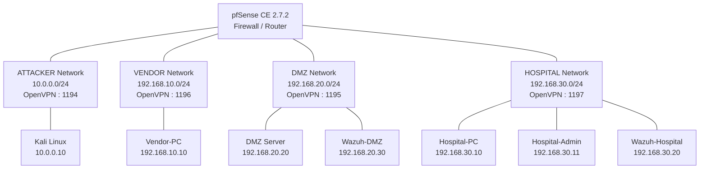

# pfSense 기반 Multi-Network OpenVPN Lab

> pfSense CE 2.7.2를 이용하여 ATTACKER, VENDOR, DMZ, HOSPITAL 네트워크를 OpenVPN으로 구성하고,
> 고정 IP 할당, 네트워크 간 라우팅, 방화벽 정책 및 트러블슈팅을 정리한 문서입니다.

---

## 1. Lab Overview

본 환경은 pfSense를 중앙 방화벽 및 라우터로 사용하여 여러 개의 독립된 네트워크를
OpenVPN으로 연결하는 실습 환경입니다.

주요 네트워크는 다음과 같습니다.

| Network | CIDR | OpenVPN Server | Port |
|---|---|---|---:|
| ATTACKER | `10.0.0.0/24` | VPN-ATTACKER | `1194` |
| DMZ | `192.168.20.0/24` | VPN-DMZ | `1195` |
| VENDOR | `192.168.10.0/24` | VPN-VENDOR | `1196` |
| HOSPITAL | `192.168.30.0/24` | VPN-HOSPITAL | `1197` |

---

## 2. Network Architecture



---

## 3. System Configuration

### 3.1 C2 / Attacker

| Item | Value |
|---|---|
| OS | Kali Linux 26.2 |
| Username / CN | `Kali` |
| Network | ATTACKER |
| Static IP | `10.0.0.10/24` |
| VPN | VPN-ATTACKER (`1194`) |

주요 역할:

- 공격 도구 실행
- LEMURLOOT 응용 웹셸/페이로드 저장
- C2 Listener 실행
- C2 통신 대기

---

### 3.2 DMZ File Transfer Server

| Item | Value |
|---|---|
| OS | Ubuntu Server 26.04.1 LTS |
| Username / CN | `DMZ` |
| Network | DMZ |
| Static IP | `192.168.20.20/24` |
| VPN | VPN-DMZ (`1195`) |

주요 역할:

- Shield Secure Transfer MFT 모의 서비스 제공
- 웹 취약점(SQL Injection) 실습 대상
- 최초 침투 지점 역할
- Wazuh Agent 설치

---

### 3.3 Wazuh DMZ

| Item | Value |
|---|---|
| OS | Ubuntu Server 26.04.1 LTS |
| Username / CN | `Wazuh-DMZ` |
| Network | DMZ |
| Static IP | `192.168.20.30/24` |
| VPN | VPN-DMZ (`1195`) |

주요 역할:

- DMZ Endpoint 로그 실시간 수집
- 이벤트 분석
- Dashboard 기반 공격 탐지 룰 시각화

---

### 3.4 Hospital User PC

| Item | Value |
|---|---|
| OS | Windows 10 |
| Username / CN | `Hospital-PC` |
| Network | HOSPITAL |
| Static IP | `192.168.30.10/24` |
| VPN | VPN-HOSPITAL (`1197`) |

주요 역할:

- B2B 수신 폴더 설치 및 실행 대상
- Sysmon 설치
- Wazuh Agent 설치

수집 이벤트:

```text
Sysmon Event ID 1
Sysmon Event ID 11
```

---

### 3.5 Hospital Admin PC

| Item | Value |
|---|---|
| OS | Windows 10 |
| Username / CN | `Hospital-Admin` |
| Network | HOSPITAL |
| Static IP | `192.168.30.11/24` |
| VPN | VPN-HOSPITAL (`1197`) |

주요 역할:

- B2B 수신 폴더를 일반 직원 PC에 배포
- Sysmon 설치
- Wazuh Agent 설치

---

### 3.6 Wazuh Hospital

| Item | Value |
|---|---|
| OS | Ubuntu Server 26.04.1 LTS |
| Username / CN | `Wazuh-Hospital` |
| Network | HOSPITAL |
| Static IP | `192.168.30.20/24` |
| VPN | VPN-HOSPITAL (`1197`) |

주요 역할:

- Hospital Endpoint 로그 실시간 수집
- 이벤트 분석
- Dashboard 기반 공격 탐지 룰 시각화

---

### 3.7 Vendor PC

| Item | Value |
|---|---|
| OS | Windows 10 |
| Username / CN | `Vendor-PC` |
| Network | VENDOR |
| Static IP | `192.168.10.10/24` |
| VPN | VPN-VENDOR (`1196`) |

---

# 4. pfSense

## 4.1 Version

```text
pfSense CE 2.7.2
```

pfSense Web GUI의 관리자 계정 비밀번호는 GitHub와 같은 공개 저장소에 기록하지 않는다.

권장 방식:

```text
Username: admin
Password: <stored-in-secret-manager>
```

---

# 5. OpenVPN Client 추가

새로운 컴퓨터 또는 OpenVPN 계정을 추가할 때는 아래 순서로 진행한다.

---

## 5.1 User 생성

pfSense Web GUI에서 다음 메뉴로 이동한다.

```text
System
 └─ User Manager
     └─ Users
         └─ Add
```

Username을 입력한다.

```text
Username = Certificate CN
```

예:

```text
Vendor-PC
Hospital-PC
Hospital-Admin
```

사용자 생성 시 다음 옵션을 활성화한다.

```text
Click to create a user certificate
```

CA는 다음 CA를 사용한다.

```text
pfSense-Lab-CA
```

> Username과 인증서 CN이 정확히 일치하도록 사용자 생성 과정에서 인증서를 함께 생성하는 것을 권장한다.

---

# 6. Client Specific Override

사용자 인증서 생성 후 해당 클라이언트에 고정 IP를 할당한다.

메뉴:

```text
VPN
 └─ OpenVPN
     └─ Client Specific Overrides
         └─ Add
```

---

## 6.1 Server List

해당 사용자가 접속해야 하는 OpenVPN 서버를 선택한다.

예:

```text
Kali
→ VPN-ATTACKER
```

```text
Vendor-PC
→ VPN-VENDOR
```

```text
Hospital-PC
→ VPN-HOSPITAL
```

---

## 6.2 Common Name

Common Name에는 인증서의 CN 값을 정확하게 입력한다.

확인 위치:

```text
System
 └─ Certificates
```

예:

```text
Hospital-Admin
```

주의:

```text
Hospital-Admin != hospital-admin
```

CN은 대소문자까지 정확하게 일치해야 한다.

---

## 6.3 Static Tunnel IP

`IPv4 Tunnel Network`에 원하는 고정 IP를 입력한다.

예:

```text
10.0.0.10/24
```

또는

```text
192.168.30.11/24
```

---

# 7. OpenVPN Client Export

고정 IP 설정이 완료되면 Client Export를 진행한다.

메뉴:

```text
VPN
 └─ OpenVPN
     └─ Client Export
```

---

## 7.1 Remote Access Server

사용자가 접속할 OpenVPN 서버를 선택한다.

예:

```text
VPN-HOSPITAL
```

---

## 7.2 Legacy Client

구버전 OpenVPN과 호환이 필요한 경우 다음 옵션을 활성화한다.

```text
Legacy Client
```

특히 OpenVPN 2.5 이하 환경에서 필요할 수 있다.

---

## 7.3 OVPN Export

사용자의 다음 항목을 다운로드한다.

```text
Inline Configurations
 └─ Most Clients
```

결과:

```text
<username>.ovpn
```

---

# 8. Client OpenVPN 설치

내보낸 `.ovpn` 파일을 클라이언트에 배포한다.

예:

```text
Hospital-Admin.ovpn
Vendor-PC.ovpn
Kali.ovpn
```

OpenVPN Client 설치 후 해당 설정 파일을 이용하여 VPN에 접속한다.

---

# 9. Inter-Network Routing

각 OpenVPN Network가 서로 다른 Network와 통신하려면
pfSense가 각 클라이언트에게 다른 네트워크의 Route 정보를 전달해야 한다.

사용하는 OpenVPN 서버:

```text
VPN-ATTACKER
VPN-DMZ
VPN-VENDOR
VPN-HOSPITAL
```

메뉴:

```text
VPN
 └─ OpenVPN
     └─ Servers
         └─ Edit
             └─ Tunnel Settings
```

설정 항목:

```text
IPv4 Local network(s)
```

현재 OpenVPN 서버 자신의 네트워크를 제외한
나머지 네트워크를 입력한다.

---

## 9.1 VPN-ATTACKER

ATTACKER Network:

```text
10.0.0.0/24
```

`IPv4 Local network(s)`:

```text
192.168.20.0/24,192.168.10.0/24,192.168.30.0/24
```

---

## 9.2 VPN-DMZ

DMZ Network:

```text
192.168.20.0/24
```

`IPv4 Local network(s)`:

```text
10.0.0.0/24,192.168.10.0/24,192.168.30.0/24
```

---

## 9.3 VPN-VENDOR

VENDOR Network:

```text
192.168.10.0/24
```

`IPv4 Local network(s)`:

```text
10.0.0.0/24,192.168.20.0/24,192.168.30.0/24
```

---

## 9.4 VPN-HOSPITAL

HOSPITAL Network:

```text
192.168.30.0/24
```

`IPv4 Local network(s)`:

```text
10.0.0.0/24,192.168.10.0/24,192.168.20.0/24
```

---

# 10. Apply Routing Configuration

모든 OpenVPN 서버 설정이 완료되면 다음을 수행한다.

```text
Save
→ Apply Changes
```

기존에 VPN에 접속하고 있던 클라이언트는 반드시 VPN을 재연결한다.

이유:

```text
IPv4 Local network(s)
```

변경을 통해 push되는 새로운 Route 정보는 이미 연결되어 있는
세션에 자동으로 반영되지 않기 때문이다.

---

# 11. Route 확인

Linux Client:

```bash
ip route
```

예를 들어 ATTACKER Client에서는 다음 네트워크가
VPN 인터페이스를 통해 확인되어야 한다.

```text
192.168.10.0/24
192.168.20.0/24
192.168.30.0/24
```

연결 테스트:

```bash
ping -c 4 192.168.30.11
```

---

# 12. Firewall Rules

pfSense에서 네트워크 간 통신을 제어하기 위해 Firewall Rule을 설정한다.

테스트 과정에서 다음과 같은 임시 규칙을 사용할 수 있다.

```text
TEMP - allow all
```

이 규칙이 활성화되어 있다면 모든 경로가 허용된 상태이다.

정책 기반 제어를 적용하려면 해당 규칙을 Disable 또는 제거하고
필요한 통신만 허용한다.

예시 정책:

```text
ATTACKER  → DMZ       Allow
HOSPITAL  → DMZ       Allow
VENDOR    → DMZ       Allow
Others                Block
```

pfSense는 명시적인 허용 규칙과 일치하지 않는 트래픽을 차단하도록
정책을 구성할 수 있다.

---

## 12.1 Port 기반 Rule

Firewall Rule 작성 시 목적에 따라 다음 항목을 설정한다.

```text
Source
Source Port
Destination
Destination Port
Protocol
```

예:

```text
Source      : ATTACKER_NET
Destination : DMZ_NET
Protocol    : TCP
Destination Port : <service-port>
```

---

# 13. Firewall Alias

관리 편의를 위해 각 Network를 Alias로 등록할 수 있다.

예:

```text
ATTACKER_NET
VENDOR_NET
DMZ_NET
HOSPITAL_NET
```

CIDR 예:

```text
ATTACKER_NET = 10.0.0.0/24
VENDOR_NET   = 192.168.10.0/24
DMZ_NET      = 192.168.20.0/24
HOSPITAL_NET = 192.168.30.0/24
```

pfSense 메뉴:

```text
Firewall
 └─ Aliases
```

---

# 14. Troubleshooting

## 14.1 VPN 연결 후 ping이 느리거나 Packet Loss 발생

Windows에서 TAP Adapter가 여러 개 생성되었는지 확인한다.

정상 예:

```text
TAP-Windows Adapter V9
IP: 192.168.30.11
```

문제 예:

```text
TAP-Windows Adapter V9 #2
IP: 169.254.x.x
```

`169.254.0.0/16` 주소는 정상적인 VPN 고정 IP가 아닌 상태이다.

---

### OpenVPN 중복 프로세스 확인

Windows 작업 관리자에서 다음 프로세스가 여러 개 실행되고 있는지 확인한다.

```text
openvpn.exe
```

GUI로 연결한 OpenVPN과 OpenVPN Service가 동시에 실행되면
복수 TAP Adapter가 생성될 수 있다.

중복 프로세스를 종료한 뒤 OpenVPN Service를 다시 시작한다.

Linux:

```bash
ps aux | grep openvpn
```

필요한 경우 중복 프로세스를 확인한 뒤 종료한다.

```bash
sudo kill <PID>
```

---

## 14.2 pfSense VM CPU 확인

pfSense 메뉴:

```text
Status
 └─ Dashboard
```

CPU Usage가 지속적으로 높다면 pfSense VM의 자원 부족 가능성을 확인한다.

실습 환경에서는 VM 종료 후 Processor 수를 늘리는 방법을 검토할 수 있다.

예:

```text
CPU
1 vCPU
↓
2 vCPU
```

---

## 14.3 다수 Client 동시 접속

하나의 네트워크 또는 공유기 환경에서 여러 Client가 동시에 VPN에 연결될 경우
병목이 발생할 수 있다.

확인 메뉴:

```text
Status
 └─ OpenVPN
```

확인 항목:

```text
Client Connections
CPU Usage
```

---

# 15. VPN Tunnel 자체가 연결되지 않는 경우

## 15.1 WAN Firewall Port

다음 OpenVPN Port가 WAN Firewall에서 허용되어 있는지 확인한다.

```text
1194
1195
1196
1197
```

메뉴:

```text
Firewall
 └─ Rules
     └─ WAN
```

---

## 15.2 Server Mode

OpenVPN Server Mode가 다음 설정인지 확인한다.

```text
Remote Access (SSL/TLS)
```

잘못된 예:

```text
Peer to Peer
```

---

## 15.3 Legacy Client

구버전 OpenVPN Client를 사용하는 경우 `.ovpn` 파일을 Export할 때
`Legacy Client` 옵션이 적용되어 있는지 확인한다.

---

# 16. Static IP가 적용되지 않는 경우

증상:

```text
설정한 IP가 아닌 .2 또는 .3 등의 주소가 할당됨
```

확인할 항목:

```text
Client Specific Override
→ Common Name
```

Common Name과 인증서 CN이 정확히 일치해야 한다.

인증서 확인:

```text
System
 └─ Certificates
```

CN을 직접 복사하여 Client Specific Override의 Common Name에 입력한다.

대소문자도 반드시 일치해야 한다.

---

# 17. 같은 Network는 통신되지만 다른 Network는 통신되지 않는 경우

예:

```text
10.0.0.1          → 통신 가능
192.168.30.11     → 통신 불가
```

각 OpenVPN Server의 다음 설정을 확인한다.

```text
IPv4 Local network(s)
```

현재 Network를 제외한 다른 Network들의 CIDR이 모두 입력되어 있어야 한다.

설정 변경 후 반드시 VPN Client를 재연결한다.

---

# 18. Firewall Log가 없는데 통신되지 않는 경우

Firewall Log에 Drop 기록조차 없다면 Firewall보다
Routing 문제를 먼저 확인한다.

pfSense Shell:

```bash
netstat -rn -f inet
```

확인 사항:

```text
Destination Network
Gateway
Interface
```

해당 Network가 올바른 OpenVPN Server Interface(`ovpnsX`)로
Routing되어 있는지 확인한다.

또한 사용하지 않는 VLAN Interface가 동일한 Network를 점유하고 있지 않은지 확인한다.

메뉴:

```text
Interfaces
```

사용하지 않는 VLAN Interface는 필요에 따라 비활성화한다.

---

# 19. 한 방향 Ping만 가능한 경우

예:

```text
A → B : Success
B → A : Failed
```

이 경우 pfSense뿐 아니라 목적지 운영체제의 Local Firewall도 확인한다.

특히 Windows에서는 Inbound ICMP가 차단될 수 있다.

확인 대상:

```text
Windows Defender Firewall
Inbound Rules
ICMP
```

---

# 20. Boot 시 VPN 자동 연결 문제

## Windows

서비스 관리:

```text
services.msc
```

확인:

```text
OpenVPNService
Startup Type: Automatic
```

자동으로 연결할 `.ovpn` 파일은 다음 경로의 설정 폴더를 사용한다.

```text
config-auto
```

주의:

```text
config      ❌
config-auto ✅
```

---

## Linux

OpenVPN Client Service 상태 확인:

```bash
sudo systemctl is-enabled openvpn-client@<name>
```

정상:

```text
enabled
```

---

# 21. Verification Checklist

설정 완료 후 다음 항목을 확인한다.

```text
[ ] pfSense OpenVPN Server 4개 동작
[ ] 각 Client Certificate 생성
[ ] Certificate CN과 Common Name 일치
[ ] Client Specific Override 고정 IP 적용
[ ] VPN Client 정상 연결
[ ] ip route에서 다른 Network Route 확인
[ ] VPN Client 재연결 완료
[ ] Firewall Alias 설정
[ ] 필요한 Network 간 Firewall Rule 적용
[ ] 목적지 OS Firewall 확인
[ ] Wazuh Agent 연결 상태 확인
```

---

# 22. Network Summary

```text
                           pfSense CE 2.7.2
                                  │
            ┌─────────────────────┼──────────────────────┐
            │                     │                      │
            │                     │                      │
      VPN-ATTACKER             VPN-DMZ              VPN-HOSPITAL
        UDP 1194              UDP 1195                UDP 1197
            │                     │                      │
       10.0.0.0/24         192.168.20.0/24        192.168.30.0/24
            │                     │                      │
       Kali Linux         DMZ Server / Wazuh       Hospital Clients


                                  │
                             VPN-VENDOR
                              UDP 1196
                                  │
                           192.168.10.0/24
                                  │
                              Vendor-PC
```

---

# 23. Security Notes

실제 운영 환경 또는 Public GitHub Repository에 다음 정보를 업로드하지 않는다.

```text
- pfSense 관리자 Password
- OpenVPN Private Key
- Client Certificate Private Key
- 실제 서비스 Credential
- Wazuh API Credential
- .ovpn 파일 원본
- 내부 운영망에서 사용하는 실제 IP/Domain 정보
```

민감정보는 환경변수, Secret Manager 또는 GitHub Secrets 등을 이용해 별도로 관리한다.

예:

```bash
PFSENSE_PASSWORD="<SECRET>"
```

`.gitignore` 예:

```gitignore
# OpenVPN
*.ovpn
*.key
*.p12
*.pfx

# Certificates
private/
certs/private/

# Secrets
.env
.env.*
secrets/
credentials/

# Logs
*.log
```

---

# 24. Repository Structure

권장 Repository 구조:

```text
pfSense-OpenVPN-Lab/
│
├── README.md
│
├── docs/
│   ├── network-topology.md
│   ├── openvpn-client.md
│   ├── routing.md
│   ├── firewall.md
│   └── troubleshooting.md
│
├── images/
│   ├── pfsense-login.png
│   ├── user-manager.png
│   ├── client-specific-override.png
│   ├── client-export.png
│   ├── routing-setting.png
│   ├── firewall-rules.png
│   └── aliases.png
│
└── .gitignore
```

---

## Environment

```text
pfSense CE      : 2.7.2
Kali Linux      : 26.2
Ubuntu Server   : 26.04.1 LTS
Windows         : Windows 10
VPN             : OpenVPN
SIEM            : Wazuh
```

---

## Purpose

이 Repository는 pfSense와 OpenVPN을 이용한 다중 Network 구성,
Network Segmentation, Routing, Firewall Policy 및
Wazuh 기반 Endpoint Monitoring 실습 내용을 기록하기 위한 목적으로 작성되었습니다.

> 본 환경은 보안 교육 및 통제된 실습 환경을 목적으로 구성되었습니다.
