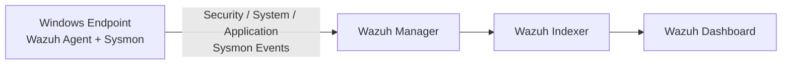

# 🛡️ Wazuh SIEM Detection Lab

> Wazuh SIEM과 Sysmon을 활용하여 Windows Endpoint의 보안 이벤트를 수집하고,
> 공급망 공격 시나리오를 기반으로 행위 기반 탐지 규칙을 설계한 프로젝트입니다.

---

## 📌 Project Overview

본 프로젝트에서는 Wazuh SIEM을 Docker 기반으로 구축하고
Windows Endpoint에 Wazuh Agent와 Sysmon을 설치하여 이벤트를 수집합니다.

이후 공급망 공격 시나리오를 기반으로 다음 공격 단계를 탐지하도록
Wazuh Custom Rule을 설계합니다.

```text
SQL Injection
      ↓
공급망 파일 위변조
      ↓
사용자 악성 파일 실행
      ↓
Credential Stealer 실행
      ↓
탈취 결과 파일 생성
      ↓
Archive 생성 및 C2 유출
      ↓
Ransomware 감염
      ↓
Ransom Note 생성
```

주요 구성 요소:

```text
Wazuh Manager
Wazuh Indexer
Wazuh Dashboard
Wazuh Agent
Sysmon
Docker
Docker Compose
```

---

# 🏗️ Architecture



---

# 🖥️ Environment

| Component | Environment |
|---|---|
| SIEM | Wazuh |
| Deployment | Docker / Docker Compose |
| Server OS | Ubuntu Server |
| Ubuntu ISO | `ubuntu-26.04.1-live-server-amd64.iso` |
| Wazuh Docker | `v4.14.7` |
| Endpoint | Windows |
| Endpoint Logging | Sysmon |

---

# 🚀 Wazuh Installation

## 1. Ubuntu 패키지 업데이트

```bash
sudo apt update
```

---

## 2. Git 설치

```bash
sudo apt install -y git
```

---

## 3. Docker 확인

Docker와 Docker Compose가 정상적으로 설치되어 있는지 확인합니다.

```bash
sudo docker --version
```

```bash
sudo docker compose version
```

---

# ⚙️ Kernel Configuration

Wazuh Indexer가 충분한 가상 메모리 영역을 사용할 수 있도록
`vm.max_map_count` 값을 설정합니다.

```bash
echo "vm.max_map_count=262144" | sudo tee /etc/sysctl.d/99-wazuh.conf
```

설정 적용:

```bash
sudo sysctl --system
```

설정 확인:

```bash
sysctl vm.max_map_count
```

정상 값:

```text
vm.max_map_count = 262144
```

---

# 📦 Wazuh Docker Download

Wazuh Docker Repository를 Clone 합니다.

```bash
git clone https://github.com/wazuh/wazuh-docker.git -b v4.14.7
```

Single Node 디렉터리로 이동합니다.

```bash
cd wazuh-docker/single-node
```

---

# 🔐 SSL Certificate Generation

Wazuh 구성요소 간 암호화 통신에 사용할 인증서를 생성합니다.

```bash
sudo docker compose -f generate-indexer-certs.yml run --rm generator
```

생성된 인증서 확인:

```bash
ls -l config/wazuh_indexer_ssl_certs/
```

---

# 🐳 Wazuh Container 실행

```bash
sudo docker compose up -d
```

Docker Compose 상태 확인:

```bash
sudo docker compose ps
```

전체 Docker Container 확인:

```bash
sudo docker ps
```

---

# 🌐 Wazuh Dashboard 접속

브라우저에서 다음 주소로 접속합니다.

```text
https://<WAZUH_SERVER_IP>
```

예:

```text
https://192.168.x.x
```

로그인 정보는 다음과 같이 별도로 관리합니다.

```text
Username: admin
Password: <WAZUH_ADMIN_PASSWORD>
```

---

# 🖥️ Windows Agent + Sysmon

Windows Endpoint에는 다음 구성요소를 설치합니다.

```text
Wazuh Agent
Sysmon
```

Wazuh Agent가 Windows 기본 Event Log와 Sysmon Event Log를
Wazuh Manager로 전송하도록 구성합니다.

---

# 📂 Wazuh Agent Group 설정

Wazuh Dashboard에서 다음 순서로 이동합니다.

```text
Agent Management
    ↓
Groups
    ↓
Windows
    ↓
Files
    ↓
Edit group configuration
```

다음 설정을 추가합니다.

```xml
<agent_config os="Windows">

    <localfile>
        <location>Microsoft-Windows-Sysmon/Operational</location>
        <log_format>eventchannel</log_format>
    </localfile>

</agent_config>
```

이를 통해 Windows Agent가 Sysmon Operational Event를 수집합니다.

---

# 📝 기본 Windows Event Log

Wazuh Windows Agent 설치 시 다음 Event Channel은 기본적으로
수집 대상으로 설정됩니다.

```text
Security
System
Application
```

Sysmon Event Log는 별도로 추가합니다.

```text
Microsoft-Windows-Sysmon/Operational
```

---

# 🔌 Agent ↔ Wazuh Manager 연결 확인

Windows PowerShell:

```powershell
Test-NetConnection <UBUNTU_WAZUH_IP> -Port <UBUNTU_WAZUH_PORT>
```

예:

```powershell
Test-NetConnection 192.168.20.30 -Port 1514
```

정상적인 경우:

```text
TcpTestSucceeded : True
```

---

# 🔄 Wazuh Container 재시작

Wazuh Dashboard 접속 또는 Container에 문제가 있는 경우:

```bash
sudo docker compose down
```

```bash
sudo docker compose up --build -d
```

상태 확인:

```bash
sudo docker compose ps
```

---

# ♻️ VM 재부팅 후 Container 자동 실행

Docker Compose 서비스별로 다음 옵션을 사용할 수 있습니다.

```yaml
restart: unless-stopped
```

예:

```yaml
services:

  wazuh-manager:
    restart: unless-stopped

  wazuh-indexer:
    restart: unless-stopped

  wazuh-dashboard:
    restart: unless-stopped
```

각 Container마다 `restart` 정책을 지정해야 합니다.

---

# ⚠️ Disclaimer

본 프로젝트는 보안 교육 및 통제된 실습 환경에서
SIEM 탐지 기술을 연구하기 위한 목적으로 작성되었습니다.

실제 시스템에서는 조직의 정책, 네트워크 구성,
Wazuh 및 Sysmon 버전에 따라 Rule ID와 Event Field가 다를 수 있으므로
운영 환경에 적용하기 전에 별도의 검증이 필요합니다.
